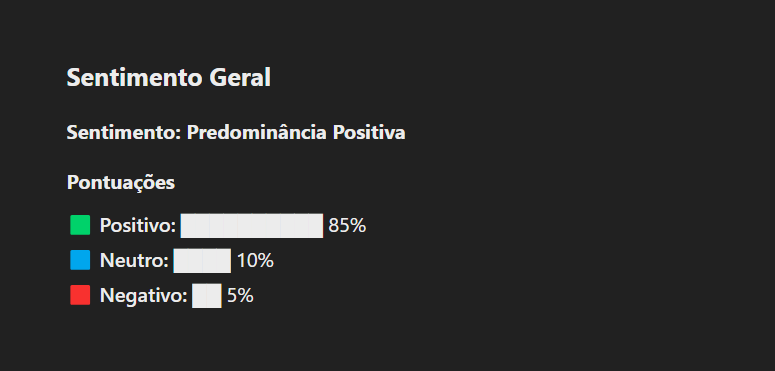
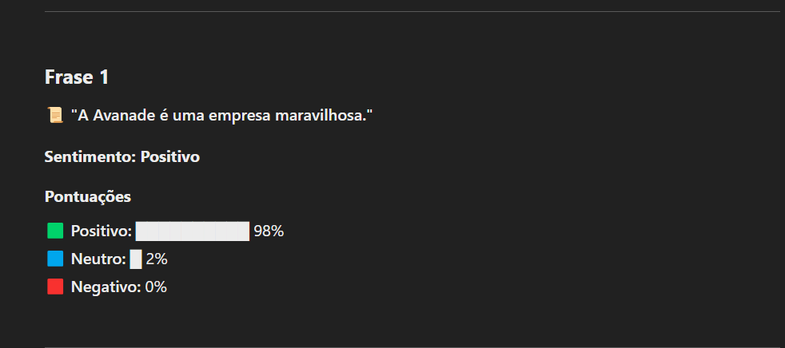
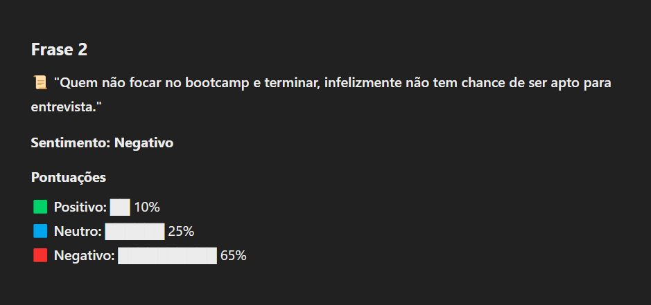
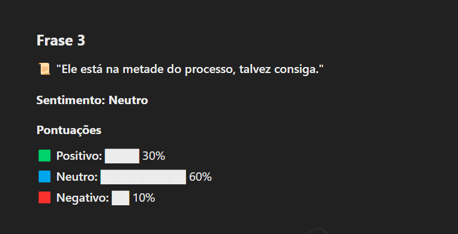

# 🚀 Análise de Sentimentos

## 🎯 Contexto
Devido a restrições de acesso ao **Microsoft Language Studio**, não pude utilizar a plataforma para realizar a análise de sentimentos conforme solicitado. O problema ocorreu porque o acesso ao serviço exige uma conta corporativa ou de estudante, e eu não possuo uma dessas credenciais.

## 🛠️ Solução Criativa
Diante dessa limitação, decidi buscar uma alternativa para concluir a atividade. Utilizei o ChatGPT para realizar a análise de sentimentos de forma semelhante, mantendo a estrutura solicitada na atividade. A IA gerou uma tabela com as classificações de sentimentos (positivo, neutro e negativo) e suas respectivas pontuações.

## 📋 Compreensão do Conteúdo
Apesar da dificuldade de acesso ao **Language Studio**, compreendi o conceito ensinado em aula. Se tivesse acesso à ferramenta correta, conseguiria realizar a tarefa sem maiores dificuldades, pois entendi como funciona o processo de análise de sentimentos e como a ferramenta deve ser utilizada.

## 🚧 Impacto na Atividade
A limitação de acesso prejudicou a execução direta da atividade conforme solicitado. No entanto, encontrei uma forma alternativa de concluir a tarefa e demonstrar meu entendimento do tema, garantindo que a proposta original fosse atendida da melhor forma possível.

## 📝 Frases Utilizadas
1. **A Avanade é uma empresa maravilhosa.**
2. **Quem não focar no bootcamp e terminar, infelizmente não tem chance de ser apto para entrevista.**
3. **Ele está na metade do processo, talvez consiga.**

## 📂 Imagens do Projeto
As imagens do funcionamento do projeto estão disponíveis abaixo:

   
  
  
    

## 📌 Conclusão
Diante do problema externo que impediu o uso da ferramenta da Microsoft, busquei uma solução viável e criativa para concluir a atividade. Se no futuro houver uma alternativa de acesso ao **Language Studio**, poderei validar os resultados obtidos e comparar com a análise feita via ChatGPT. O importante é que o aprendizado não foi comprometido e consegui atingir o objetivo da atividade dentro das possibilidades disponíveis.

